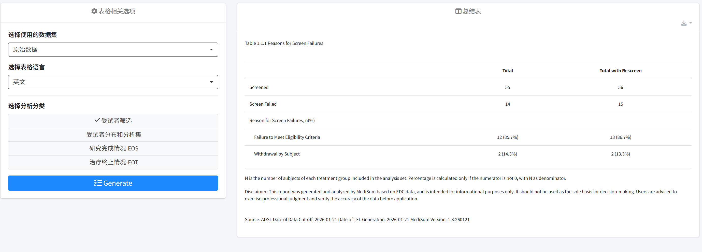
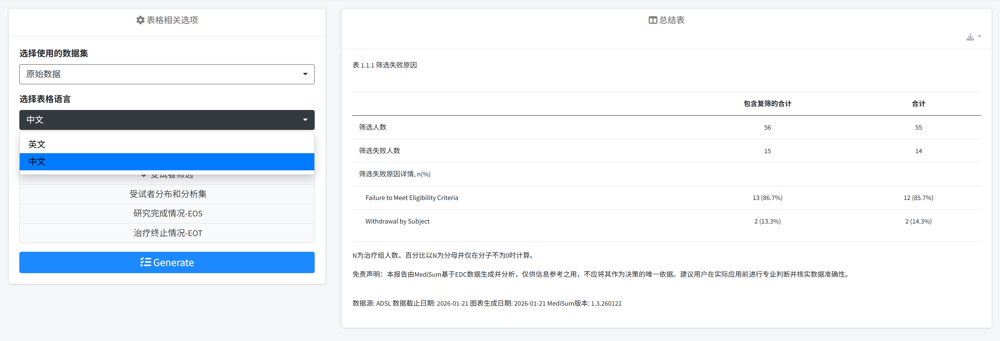
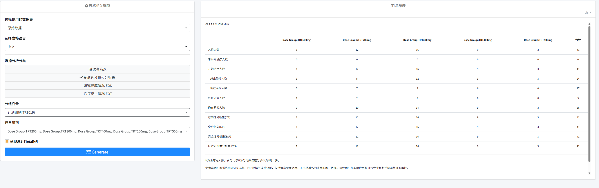
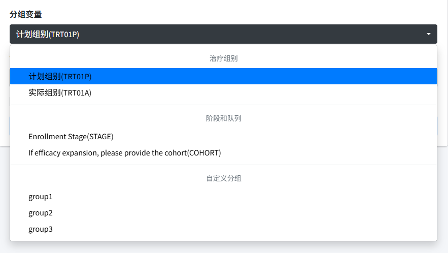
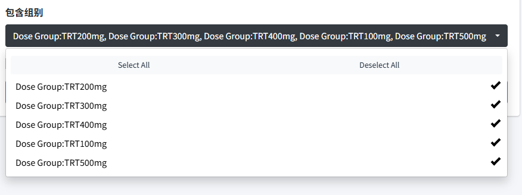
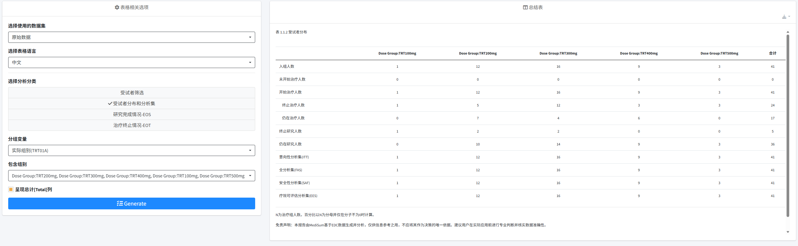
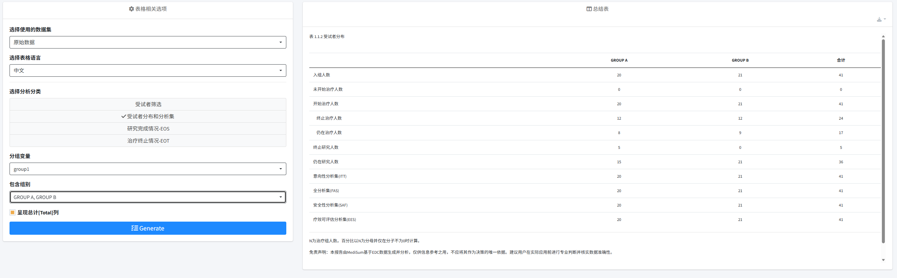
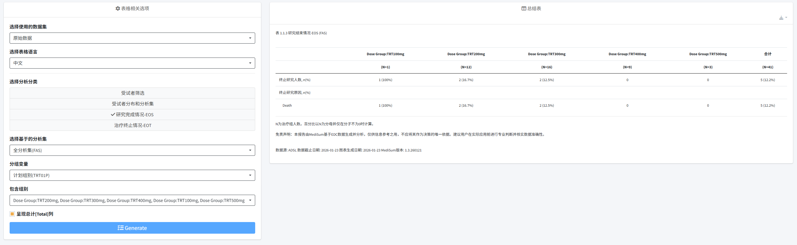
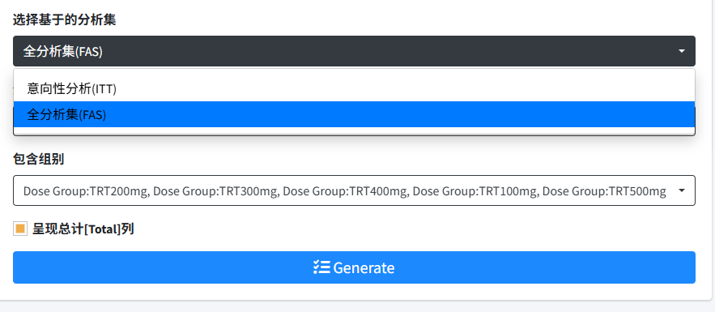
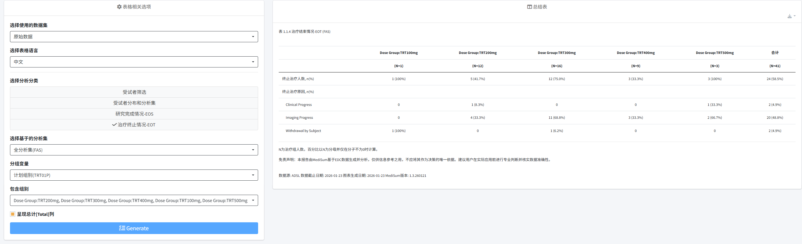

# 01 受试者分布  
受试者分布可以通过四种分类方式进行分析。  
-**【受试者筛选】**

 导入数据后，可以在左侧表格相关选项中选择使用的数据集，同时下拉表格语言，支持中英文作为表格结果的展示语言，下图为更改选用中文作为结果展示语言，此后示例均选用中文进行展示。  

-**【受试者分布和分析集】**  

 
 
选择**受试者分布和分析集**后，左侧操作栏会出现**分组变量**选项，默认为计划组别，同时可以下拉选择其余分组（如下图1）。界面支持切换分组变量进行分析，其中治疗组别、阶段和队列中的选项来源为项目收集内容，自定义分组来源为用户上传的自定义文件中的分组变量.而后可以通过**包含组别**选项筛选需纳入分析的组别（如下图2），并支持*Select All*和*Deselect All*的操作，在默认情况下通过受试者不同剂量进行分组。

该表格主要为描述受试者入组人数，未开始治疗人数，治疗中人数，治疗状态，研究状态以及各分析集人群的汇总数据，通过分组变量的筛选，可以呈现不同的结果。下图分别为内部分组（如下图1）和用户自定义分组（如下图2）的结果展示。

 

-**【研究完成情况-EOS】**   

  

选择**研究完成情况-EOS**后，左侧除**分组变量**和**包含组别**外，会新增**选择基于的分析集**，默认选项为全分析集（FAS），该表格描述终止研究人数、比例及终止研究原因。  

  

**选择基于的分析集**分为全分析集（FAS）和意向性分析（ITT）。其中全分析集（FAS）定义为所有入组的受试者，意向性分析（ITT）定义为所有入组并至少使用一次试验用药品的受试者。当使用者选择不同分析集时，研究结果及比例会随之发生改变。   

-**【治疗终止情况-EOT】**  

  

选择**治疗终止情况-EOT**后，左侧选择栏包含**分组变量**，**包含组别**以及**选择基于的分析集**，默认选项为全分析集（FAS）。该表格结果描述终止治疗人数、比例及终止治疗原因。