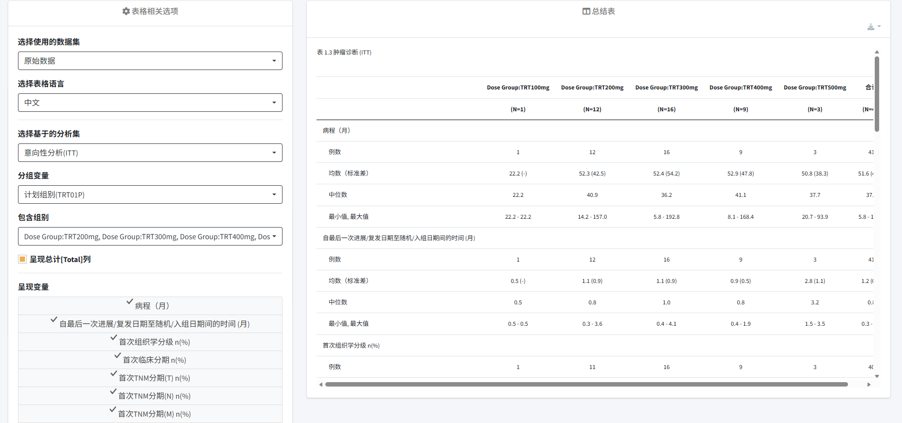
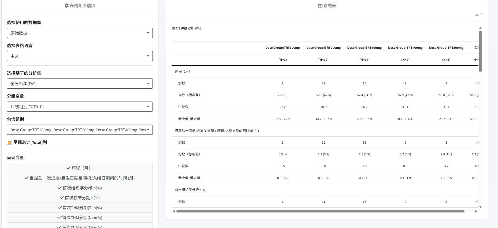
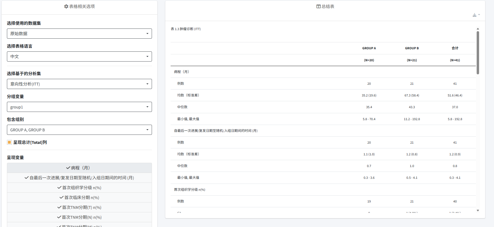
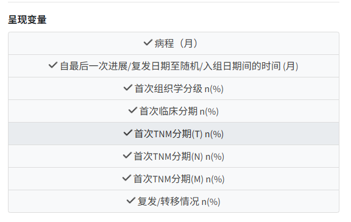

# 03 肿瘤诊断  

该表格主要呈现不同组别和呈现变量下的描述性统计。导入数据后，可以在左侧表格相关选项中选择使用的数据集，下拉表格语言，支持中英文作为表格结果的展示语言。**选择基于的分析集**，默认选项为意向性分析集（ITT）。同时**分组变量**选项，默认为计划组别，同时可以下拉选择其余分组。界面支持切换分组变量进行分析，其中治疗组别、阶段和队列中的选项来源为项目收集内容，自定义分组来源为用户上传的自定义文件中的分组变量。通过分组变量的筛选，可以呈现不同的结果。下图分别为内部分组（如下图1）和用户自定义分组（如下图2）的结果展示。  

而后可以通过**包含组别**选项筛选需纳入分析的组别，并支持*Select All*和*Deselect All*的操作。  此外**呈现变量**为该项目中识别到的页面可以提供分析的变量，用户可以自主选择表格中需要整理的变量（如下图）。
