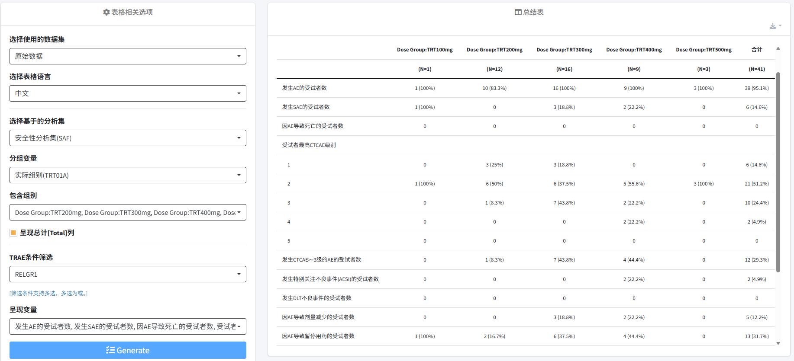
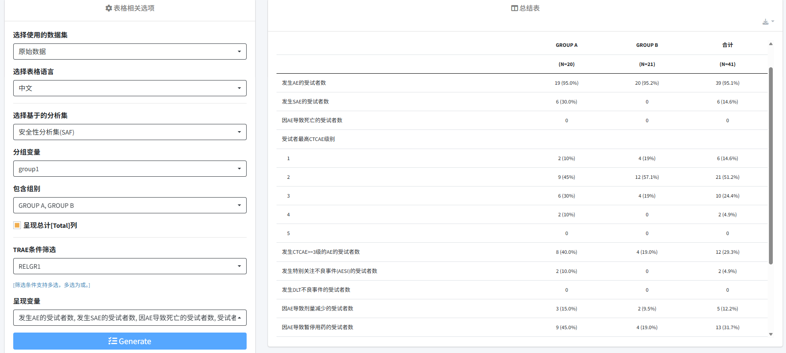
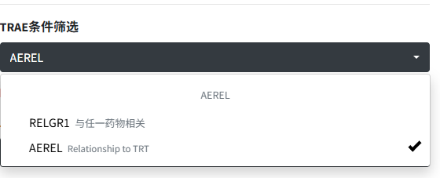
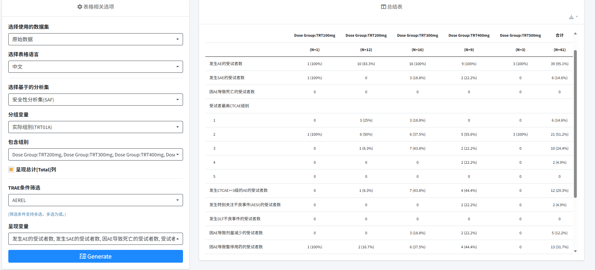
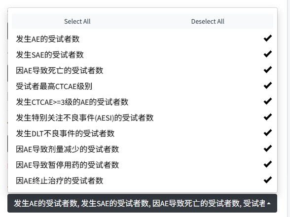

# 不良事件概况  
  

  
  

该表格采用频数和百分比方式汇总不同组别及合计组治疗后发生的不良事件的概况。导入数据后，可以在左侧表格相关选项中选择使用的数据集，下拉表格语言，支持中英文作为表格结果的展示语言。**选择基于的分析集**，仅提供选项“安全性分析集(SAF)”，无须选择。同时**分组变量**选项，默认为计划组别，同时可以下拉选择其余分组。界面支持切换分组变量进行分析，其中治疗组别、阶段和队列中的选项来源为项目收集内容，自定义分组来源为用户上传的自定义文件中的分组变量。通过分组变量的筛选，可以呈现不同的结果。下图为用户自定义分组的结果展示。  
  

  
  
  

该表格中还提供**TRAE条件筛选**，其中**RELGR1**为与任意药物相关，**AERELx**与某一药物相关，x的数量由所上传的项目决定。  
  

  
  
  

若不进行选择，则默认的选择为：总TEAE（无筛选条件）, 当两个选项都被选中时，他们的逻辑关系为**或**。勾选对应选项即按照所选的筛选条件进行汇总分析。下图为**AERELx**的结果展示。  
  

  
  
  

此外**呈现变量**为该项目中识别到的页面可以提供分析的变量，用户可以自主选择表格中需要整理的变量（如下图）。  
  

  
  

对于**联药项目**，选择**对任一药物采取的措施**条目时，会出现计算式基于的药物的多选下拉框。未选择时，呈现变量中“Subjects with dose xxx due to TEAEs: Any Drug*“/”因AE导致剂量xxx的受试者数: 任一药物*”默认包含所有AEACNx变量，即导致任一药物剂量减少/暂停用药/永久停药的受试者数。 
用户可以自由选择这个统计量关联的药物，比如这个界面需要统计与药物A或药物B相关且因AE导致药物A或药物B剂量减少的受试者数，可以在**TRAE的筛选条件**中选择药物A和药物B的AEREL变量，并在选择“**对任一药物采取的措施**条目计算时基于的药物”选项中选择药物A和药物B的AEACN变量，即可获得所需统计量。